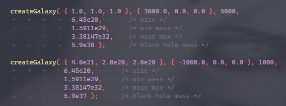

Disclaimer: This is a project I made in 2 weeks or so as a uni side project  
the code is not that great, and I have no idea for how accurate it is. Just a fun play thing

# How to use Le Space Simtulator™

| Controls         |            |
| :--------------- | :--------- |
| Move             | WASD EQ    |
| Rotate           | Arrow Keys |
| Track G1         | R          |
| Switch View Mode | T          |
| Single timestep  | G          |

### How to change parameters

in cSceneGame::create() there are two functions that create the galaxies  
change these to suit your simulation needs  
the 5000 and 1000 are the star count for each galaxy.  
min and max mass are the min and max masses of any given star in the galaxy

*note: units are in meters and kg*

